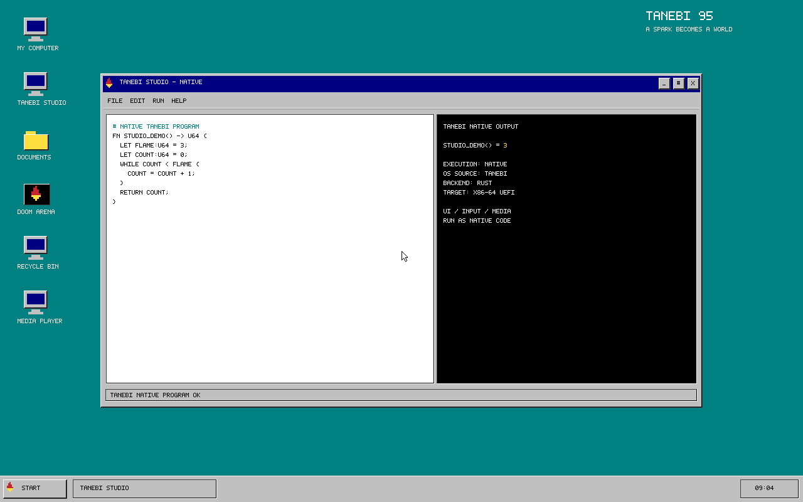

# TANEBI 95

> A spark becomes a world.

[TANEBI](https://github.com/miroqaan/tanebi-lang) で記述・コンパイルした、x86-64 UEFIから直接起動する自作OSです。ブートマネージャー、カーネル初期化、デスクトップ、PS/2入力、動画デコーダー、SB16音声の実装元は `system/*.tanebi` です。

Go製TANEBIコンパイラーがソースを構文解析・型検査してRustを生成し、rustc/LLVMがUEFI機械語へ変換します。TANEBIはコンパイラー専用の言語処理系で、OSビルドにインタープリターは使いません。Rustは生成バックエンドであり、標準ビルドは旧 `kernel/src/*.rs` や `bootmgr/src/*.rs` をコンパイルしません。外部のUEFI DOOM・Freedoom・EDK IIは上流実装を使用しています。



## 特徴

- 64 MiB の FAT16 x86-64 UEFI 起動イメージ
- `ExitBootServices` 後のベアメタル実行
- GOP フレームバッファーへの直接描画
- PS/2 I/O ポート経由のキーボード・マウス入力とソフトウェアカーソル
- TANEBIの型付き関数・固定バッファー・メモリーアクセス・UEFI FFIから生成するネイティブOS
- TANEBI Studio、スタートメニュー、電源画面
- DOOM ARENA：再起動して UEFI DOOM と Freedoom Phase 2 を実行

## ビルド

Go、Rustの `x86_64-unknown-uefi` ターゲット、コンパイラー専用CLI `cmd/tanebi` を備えた `tanebi-lang` が必要です。`tanebi-95` と `tanebi-lang` を同じ親ディレクトリーに配置してください。別の場所では `-LanguageRoot` を指定できます。

```powershell
.\scripts\build.ps1
```

スクリプトは `cmd/tanebi` から `tanebi.exe` をビルドし、`tanebi emit -target uefi -entry entry` でRustを生成します。その後のrustc実行・FAT16梱包・出自記録もスクリプトが行います。ホスト回帰テストの生成には同じCLIの `tanebi emit -target library` を使います。CLIのオプションはソースファイルより前に指定します。

生成されるファイル：

- `build/esp/EFI/BOOT/BOOTX64.EFI`
- `build/esp/KERNEL.EFI`
- `build/tanebi95.img` — 64 MiB の FAT16 UEFI 起動イメージ
- `build/generated/*.rs` — TANEBIコンパイラー出力（手編集しない）
- `build/generated/tanebi.exe` — ビルド・検証に使用するTANEBIコンパイラー
- `build/native-provenance.json` — 使用ソース・コンパイラー・イメージのSHA256と実装言語

## 起動と操作

QEMU と x86-64 EDK2 ファームウェアが必要です。

```powershell
.\scripts\run.ps1
```

キーボード：

- `S`：スタートメニュー
- `T`：TANEBI Studio ウィンドウを開く／閉じる
- `Esc`：電源画面
- `D`：DOOM ARENA に再起動
- `V`：ネイティブメディアプレーヤーを開く（`Space`：再生／一時停止）

DOOM では方向キーで移動・旋回し、`Space` で射撃、`E` でドアを開きます。
ゲーム音声は現在無効です。
標準の 1280×800 モードでは、元の 320×200 画面を整数倍の 4 倍に拡大して全画面に表示します。
このモードが使えない場合は、現在の画面に収まる最大の整数倍率を使用します。ゲームの表示領域は、ステータスバーを残した最大サイズが既定です。

マウス：

- デスクトップの `TANEBI STUDIO` アイコンをクリック
- `START` ボタンとスタートメニューの項目をクリック
- Studio ウィンドウの閉じるボタンをクリック

現在の入力は PS/2 の相対座標方式です。QEMU 画面をクリックしてマウスをキャプチャーした後、ゲスト内のポインターを基準に操作します。
高速な移動も、パケットヘッダーの符号ビットを含む 9 ビット値として処理し、オーバーフローが示された軸は無視します。
ウィンドウを最小化してバックグラウンドで実行するには、`scripts/run.ps1 -SkipBuild -Background -MonitorPort 45454` を使います。画面を表示しないのは `HeadlessTest` のみです。

## 現在の実装範囲

DOOM はカーネル内のプロセスではありません。デスクトップが CMOS に起動先の選択値を書き込んで再起動すると、ブートマネージャーが EDK II Shell と UEFI DOOM を実行します。デスクトップもゲームも QEMU 仮想マシン内で動作します。ゲームを終了し、QEMU を起動し直すとデスクトップに戻ります。

ネイティブ版のStudioは、OS内で実際に実行したTANEBI関数 `studio_demo()` の結果を表示します。この画面は自由入力のエディターや対話インタープリターではありません。メディアプレーヤーは、ビルドに組み込んだローカル動画を再生します。インターネットやYouTubeからの直接ストリーミング、一般的なMP4ファイルの読み込みは、まだサポートしていません。

### ネイティブメディアプレーヤー

デスクトップの `MEDIA PLAYER` またはスタートメニューから開きます。再生／一時停止、停止、5 秒戻る／進む、シークバー、ミュート切り替えに対応しています。初期状態はミュートです。通常の QEMU 実行では `UNMUTE` で音声を有効にし、最小化して行うテストではスピーカーに出力しません。

映像は640×360、RGB565、15fpsのTNV3形式です。フレームごとにraw・RLE・byte-LZから選んで保存し、TANEBI製デコーダーが直接展開・描画します。RustのDEFLATEライブラリーには依存しません。音声は22,050Hzの符号なし8ビット・モノラルPCMを、TANEBI製SB16/ISA DMAドライバーのダブルバッファーで出力します。ファームウェアのブートサービス終了後も再生でき、ブラウザーやホスト側のプレーヤーは使用しません。

[指定の動画](https://www.youtube.com/watch?v=low-pfQAI0A&t=974s) の 16:14–16:44 の区間は、ローカルビルドにのみ組み込んでいます。第三者の映像・音源、およびそれらを組み込んだカーネルイメージは、この公開リポジトリにはコミットしません。新しくチェックアウトした環境では、動画を用意するまで `NO MEDIA` と表示されます。

```powershell
# 該当する 30 秒の動画ファイルをローカルに用意した場合
.\scripts\prepare-media.ps1 -SourceVideo .\build\player-source.mp4
.\scripts\build.ps1
# スピーカーに出力せず、PCM 出力をファイルで検証
.\scripts\run.ps1 -SkipBuild -Background -AudioLog build\media-audio.wav
```

`scripts/capture-desktop-clean.ps1 -Media` は、最小化した別の VM で内部フレームバッファーのみを撮影します。`scripts/render-native-fullframe.ps1 -Media` は、実際のクリック位置の表示と日本語解説を含む 2560×1600 の紹介動画を作成します。

このバージョンは、実際に UEFI から起動してファームウェアのブートサービスを終了するベアメタル Stage 1 です。その後はフレームバッファーメモリーへ直接描画し、キーボードのスキャンコードを PS/2 I/O ポートから読み取ります。

旧方式の文字列マニフェスト→手書きRustカーネルは、標準ビルドから外しました。ルートの `system.tanebi` は、その出力だけを保存する型付きのホスト用コンパイル例であり、OSビルドには使用しません。現在は `system/*.tanebi` の関数そのものが機械語になります。独立したRing 3プロセス、プロセス分離、対話的なソース編集・再コンパイル、コンパイラーのセルフホスティングは未実装です。

## 検証

```powershell
.\scripts\test.ps1
```

テストはTANEBIフロントエンド、Go製梱包ツール、TANEBIから生成したホストコードのPS/2全符号・オーバーフロー検査、描画境界・カーソル復元、ネイティブ計算、出自記録・FAT16構造、QEMUの `ExitBootServices` 後のデスクトップ起動を検証します。ローカルのメディア素材がある場合は、450フレームとPCMの完全一致、シーク、復号失敗からの復帰、DMAと再生操作も検査します。素材がない場合は、その検査を明示的にスキップします。

通常版イメージの実操作を、ホストスピーカー出力なし・画面非表示で検査するには、`scripts/test-interaction.ps1` を実行します。実際のフレームバッファーPNG、シリアルログ、音声WAVを `build/native-qa-*` に保存します。実装元は `system/*.tanebi`、自動検証の詳細は `scripts/test-native.ps1` と `tests/` を参照してください。

## プロジェクト構成

```text
system/          TANEBI製ブート・カーネル・描画・入力・動画・音声
scripts/         TANEBIビルド、QEMU起動、回帰テスト
tools/mkfat16/   ホスト用FAT16イメージビルダー（Go）
tools/mkmedia/   ホスト用TNV3メディア梱包ツール（Go）
tests/          生成コードに対するホスト回帰テスト
kernel/,bootmgr/ 旧Rust実装の比較資料（標準ビルド対象外）
docs/            公開用説明・ネイティブ画面キャプチャー
```

本プロジェクトは独自のデスクトップであり、Microsoft Windows 95、その互換レイヤー、またはそのエミュレーターではありません。Microsoft のコード、商標画像、アセットは含みません。
