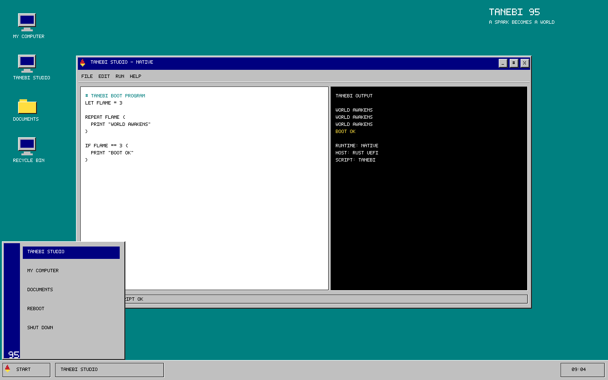

# TANEBI 95

> A spark becomes a world.

브라우저가 아닌 x86-64 UEFI 환경에서 직접 부팅되는 [TANEBI](https://github.com/miroqaan/tanebi-lang) 기반 운영체제 프로젝트다. Rust `no_std` 커널은 GOP에서 프레임버퍼 주소를 받은 뒤 `ExitBootServices`로 펌웨어 부팅 서비스를 종료하고 1990년대풍 데스크톱을 직접 그린다.



## 특징

- 32MiB FAT16 x86-64 UEFI 부팅 이미지
- `ExitBootServices` 이후 bare-metal 실행
- GOP 프레임버퍼 직접 렌더링
- PS/2 I/O 포트 기반 키보드 입력
- TANEBI 스크립트로 생성하는 결정론적 부팅 매니페스트
- TANEBI Studio, 시작 메뉴, 전원 화면

## 빌드

```powershell
.\scripts\build.ps1
```

산출물:

- `build/esp/EFI/BOOT/BOOTX64.EFI`
- `build/tanebi95.img` — 32MiB FAT16 UEFI 부팅 이미지

## 실행

QEMU와 x86-64 EDK2 펌웨어가 필요하다.

```powershell
.\scripts\run.ps1
```

키보드:

- `S`: 시작 메뉴
- `T`: TANEBI Studio 창 열기/닫기
- `Esc`: 전원 화면

## 현재 경계

이 버전은 실제로 UEFI에서 부팅한 뒤 펌웨어 부팅 서비스를 종료하는 bare-metal Stage 1이다. 이후 화면은 프레임버퍼 메모리에 직접 쓰고 키보드는 PS/2 I/O 포트에서 scan code를 읽는다.

빌드 시 공개 모듈 `github.com/miroqaan/tanebi-lang/cmd/tanebi@v0.1.0`이 `system.tanebi`를 실행하고 결정론적 결과를 커널에 포함한다. TANEBI 자체를 Ring 3 프로세스로 실행하는 단계는 페이지 테이블·syscall·프로세스 로더 이후 로드맵이다.

## 검증

```powershell
.\scripts\test.ps1
```

테스트는 TANEBI 매니페스트, UEFI PE, FAT16 구조를 검사하고 QEMU에서 `ExitBootServices` 이후 bare-metal marker까지 확인한다.

## 프로젝트 구조

```text
kernel/          Rust no_std UEFI kernel and framebuffer desktop
scripts/         build, QEMU run, and native boot test
tools/mkfat16/   deterministic FAT16 image builder
system.tanebi    TANEBI boot program
docs/            verified native screenshot
```

Microsoft Windows 95, 호환 레이어 또는 에뮬레이터가 아니며 Microsoft의 코드·상표 이미지·에셋을 포함하지 않는 독자적인 데스크톱이다.
